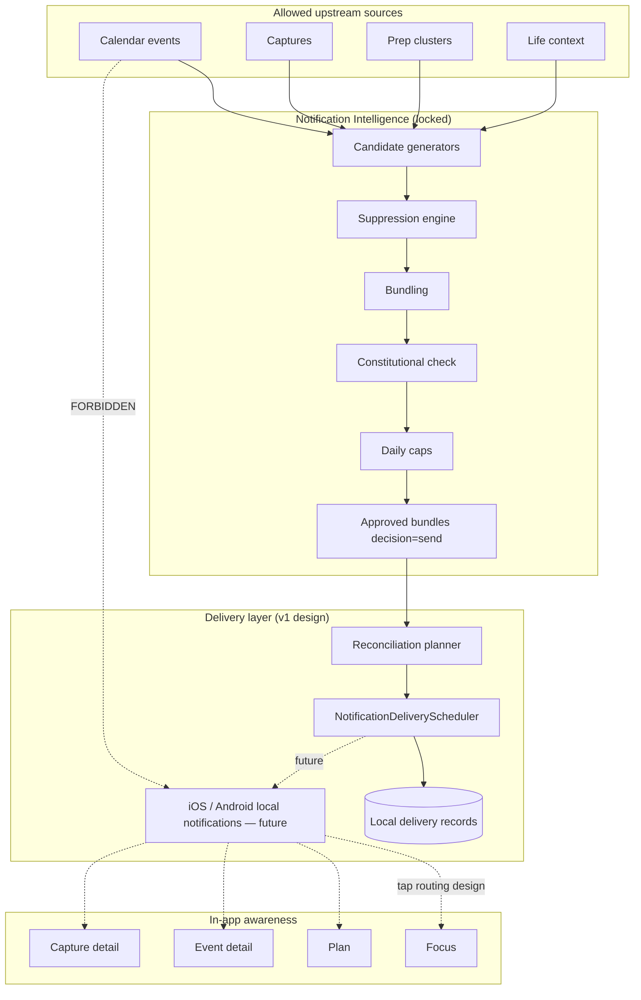

# Meridian Notification Delivery Architecture v1

**Status:** Design locked — transport layer not implemented on device OS yet.  
**Upstream dependency:** [Notification Intelligence](../rules/notification-intelligence.md) (candidates → suppression → bundling → constitutional checks → daily caps → **approved bundles only**).  
**Verification:** Notification Verification Mode (dev inspector) remains independent of delivery.

---

## Constitutional principle

> **No notification reaches the device unless it passed through Notification Intelligence first.**

Delivery is **subordinate to intelligence**. Delivery never decides *whether* something deserves interruption; it only decides *how* to transport already-approved bundles within their delivery windows.

---

## System diagram



---

## Allowed data flow

```
Calendar / Captures / Prep / Life Context
        ↓
Notification Intelligence (buildNotificationIntelligence)
        ↓
ApprovedNotificationBundle[]  (NotificationBundle where decision === 'send')
        ↓
planNotificationReconciliation (pure) + NotificationDeliveryScheduler
        ↓
ScheduledNotificationRecord[] (persisted locally)
        ↓
[Future] Expo Notifications / platform trigger
        ↓
Local notification on device
```

**Bridge from intelligence to delivery:**

- Filter: `bundles.filter(isApprovedNotificationBundle)` — never pass suppressed bundles or raw candidates.
- Copy transport fields from bundle: `title`, `lines` → `body` via `deliveryBodyFromBundle`, `targetWindowStart/End`, `candidateIds`, `bundleKey`, `type`.
- Enrich `sourceEventIds` / `sourceCaptureIds` via candidate map (`extractSourceEventIdsFromBundle`) at schedule time — not from raw calendar rows.

---

## Forbidden data flow

```
Calendar Event ──────────────→ Local Notification   ❌
Capture ─────────────────────→ Local Notification   ❌
Prep cluster ────────────────→ Local Notification   ❌
Life domain object ──────────→ Local Notification   ❌
Suppressed bundle ───────────→ Local Notification   ❌
Delivery layer generates copy ❌
Delivery increases urgency    ❌
Delivery creates candidates   ❌
Re-engagement / streak / habit ❌
```

Any code path that schedules from `MeridianCalendarEvent`, `LifeObject`, or `NotificationCandidate` without an approved bundle is a **constitutional violation**.

---

## Phase 1 — Delivery boundary

### `NotificationDeliveryScheduler` interface

Defined in `apps/mobile/src/types/notificationDelivery.ts`.

| Method | Responsibility |
|--------|----------------|
| `scheduleApprovedBundle(bundle, options?)` | Register one OS-local fire time for an **approved** bundle only |
| `cancelScheduledBundle(bundleId, reason)` | Cancel by Meridian bundle id |
| `cancelAllMeridianNotifications(reason?)` | Clear all Meridian-tagged scheduled notifications |
| `reconcileScheduledNotifications(approvedBundles, context?)` | Diff approved vs scheduled; execute plan |
| `getScheduledMeridianNotifications()` | Audit / debug / reconciliation input |

**Read-only signal:** `permissionState` — never used to generate candidates.

### Placeholder implementation

`NoOpNotificationDeliveryScheduler` (`apps/mobile/src/services/notifications/delivery/NoOpNotificationDeliveryScheduler.ts`):

- Accepts only approved bundles; rejects others with `not_approved`.
- Does not call the OS (`permissions_unavailable`).
- Runs pure reconciliation planning for verification and future wiring.

### Orchestration hook (future, not wired)

After each intelligence refresh:

```ts
const approved = snapshot.bundles.filter(isApprovedNotificationBundle);
await deliveryScheduler.reconcileScheduledNotifications(approved, {
  now,
  lastAppOpenedAt: notificationStore.lastAppOpenedAt,
  eventStartTimes: buildEventStartTimeIndex(events),
  resolvedCaptureIds: buildResolvedCaptureSet(captures),
});
```

Intelligence continues to run when permissions are `denied` or `unavailable`; delivery fails calmly.

---

## Phase 2 — Delivery record model

### `ScheduledNotificationRecord`

| Field | Purpose |
|-------|---------|
| `id` | Stable Meridian record id (UUID) |
| `bundleId` | Intelligence bundle id |
| `bundleKey` | Awareness / dedupe grouping from intelligence |
| `candidateIds` | Candidates collapsed into this delivery |
| `notificationType` | `morning_brief` \| `transition_awareness` \| `evening_wind_down` \| `critical_commitment_protection` |
| `title` / `body` | Copied from approved bundle — **not generated in delivery** |
| `scheduledFor` | Platform fire time (within `targetWindowStart`–`targetWindowEnd`) |
| `targetWindowStart` / `targetWindowEnd` | Intelligence window — used for expire + dedupe |
| `sourceEventIds` / `sourceCaptureIds` | Reconciliation triggers |
| `deliveryStatus` | `scheduled` \| `delivered` \| `cancelled` \| `expired` \| `failed` |
| `dedupeKey` | Stable duplicate prevention identity |
| `tapDestination` | Routing payload (design) |
| `platformNotificationId` | OS identifier when implemented |
| `cancellationReason` | Nullable until cancelled |
| `createdAt` / `updatedAt` | Audit |

### Delivery statuses

| Status | Meaning |
|--------|---------|
| `scheduled` | Registered with OS / in-memory store, not yet fired |
| `delivered` | OS reported presentation (or foreground equivalent logged) |
| `cancelled` | Explicitly removed before fire |
| `expired` | Window passed without delivery |
| `failed` | Transport error (permissions, OS reject) |

### Cancellation reasons

| Reason | Typical trigger |
|--------|-----------------|
| `bundle_no_longer_approved` | Intelligence suppressed or capped bundle |
| `source_event_changed` | Event start moved or removed |
| `source_capture_resolved` | Linked capture completed |
| `user_opened_app` | Recent open — in-app awareness for brief/transition types |
| `daily_cap_changed` | Caps tightened; bundle dropped from approved set |
| `permissions_unavailable` | Denied / unavailable — fail calm, no crash |
| `manual_clear` | User or dev clear-all |
| `expired` | `targetWindowEnd` < now |
| `duplicate_prevented` | Dedupe key collision |
| `content_changed` | Title/body fingerprint changed — reschedule |

---

## Phase 3 — Reconciliation logic

Pure planner: `planNotificationReconciliation` in `reconciliationPlan.ts`. The scheduler **executes** the plan (cancel OS ids, schedule new, update records).

### Inputs

- `approvedBundles: ApprovedNotificationBundle[]`
- `scheduledRecords: ScheduledNotificationRecord[]`
- `context?: NotificationDeliveryContext` (`now`, `lastAppOpenedAt`, `eventStartTimes`, `resolvedCaptureIds`)

### Per existing scheduled record

| Condition | Action | Cancellation reason (when cancel) |
|-----------|--------|-----------------------------------|
| `targetWindowEnd` < now | `expire_passed` | `expired` |
| `bundleId` ∉ approved set | `cancel_stale` | `bundle_no_longer_approved` |
| Source event start ≠ stored snapshot | `cancel_stale` then `schedule_new` | `source_event_changed` |
| Any `sourceCaptureId` resolved | `cancel_stale` | `source_capture_resolved` |
| Title/body fingerprint ≠ bundle | `reschedule_changed` | `content_changed` |
| Recent app open + brief/transition type | `cancel_stale` | `user_opened_app` |
| Otherwise | `keep_existing` | — |

### Per approved bundle without active scheduled record

| Condition | Action |
|-----------|--------|
| Dedupe key already seen in pass | `cancel_stale` (duplicate) |
| Window already passed | `expire_passed` |
| Else | `schedule_new` |

### Implementation note (event time change)

Records should persist a **snapshot** of source event start times at schedule time (e.g. `sourceEventStartSnapshots: Record<eventId, iso>`). Reconciliation compares `context.eventStartTimes[eventId]` to that snapshot — not to `scheduledFor`. Update `hasSourceEventTimeChange` when implementing the real scheduler.

---

## Phase 4 — Duplicate prevention

Never schedule two notifications for the same:

1. **bundleId** — one active scheduled record per bundle
2. **bundleKey** — same awareness group in the same window
3. **source event + window** — same event/time awareness
4. **candidate group** — same `candidateIds` set with overlapping window

### Stable dedupe key (`NotificationDeliveryDedupeKey`)

```ts
{
  bundleId,
  bundleKey,
  sourceEventIds: sorted,
  targetWindowStart: ISO,
  targetWindowEnd: ISO,
}
```

Helpers: `buildDeliveryDedupeKey`, `buildDeliveryDedupeKeyFromParts`, `extractSourceEventIdsFromBundle`.

**Scheduler rule:** Before `scheduleApprovedBundle`, check existing records for matching dedupe key with `deliveryStatus === 'scheduled'`. If match → return `{ ok: false, reason: 'duplicate' }`.

---

## Phase 5 — Permission handling (design only)

### States (`NotificationPermissionState`)

| State | Behavior |
|-------|----------|
| `unknown` | Not yet read; no prompts in v1 |
| `granted` | May schedule |
| `denied` | Fail calm; intelligence + verification unchanged |
| `provisional` | iOS provisional — treat as granted for scheduling where platform allows |
| `unavailable` | Simulator, web, or missing native module — NoOp default |

### Rules

- **No permission nagging** in delivery or intelligence paths.
- **No guilt language** in copy or error surfaces.
- `scheduleApprovedBundle` → `{ ok: false, reason: 'permissions_unavailable' }` — log at dev level only.
- App must not crash on denied/unavailable.
- Intelligence and verification mode **do not** depend on notification permission.

---

## Phase 6 — Platform strategy (not implemented)

### iOS

| Topic | Strategy |
|-------|----------|
| Foreground | Prefer in-app awareness; optionally suppress banner for types already surfaced on Focus; still log `delivered` if policy shows in-app toast |
| Background | `UNTimeIntervalNotificationTrigger` or calendar-based trigger within window; reconcile on background fetch / next foreground |
| Tap | `userInfo` carries `bundleId`, `recordId`, `tapDestination` JSON |
| Timezone / DST | On `UIApplicationSignificantTimeChange` or app resume: full `reconcileScheduledNotifications` with fresh `now` |
| App reload | Load persisted `ScheduledNotificationRecord[]`; reconcile against latest intelligence snapshot |
| Dev client | Expo custom dev client required for native notifications; NoOp safe in Expo Go until configured |

### Android

| Topic | Strategy |
|-------|----------|
| Foreground | Channel importance low for non-critical; critical protection on high-importance channel |
| Background | `AlarmManager` / scheduled notifications via Expo abstraction; exact alarm permission documented when implementing |
| Tap | Intent extras mirror iOS `userInfo` |
| Timezone | `ACTION_TIMEZONE_CHANGED` → reconcile |
| App reload | Same persisted store + reconcile |

### Shared

- Tag notifications with Meridian namespace (`meridian.bundleId` in payload).
- `cancelAllMeridianNotifications` cancels only tagged ids.
- Do not use delivery for data sync — intelligence remains source of truth.

---

## Phase 7 — Tap behavior design

`resolveNotificationTapDestination` (`resolveTapDestination.ts`) — navigation wiring deferred.

| Bundle type | Primary source | Destination |
|-------------|----------------|-------------|
| `morning_brief` | — | **Focus** |
| `evening_wind_down` | — | **Focus** |
| `transition_awareness` | event id | **Event detail** |
| `critical_commitment_protection` | event id | **Event detail** |
| `critical_commitment_protection` | no event | **Plan** |
| Capture-only (no event) | capture id | **Capture detail** |
| Default timeline awareness | — | **Plan** |

**Rules:**

- Route from **bundle type + primary source ids**, not from raw notification text parsing.
- Event-specific notifications open event context, not generic Focus.
- Morning brief opens Focus (day orientation), not Plan week grid.

Future: deep link table on `RootNavigator` reading `NotificationTapDestination`.

---

## Phase 8 — Storage design

### Persistence

- **Key:** `meridian-notification-delivery-v1` (`NOTIFICATION_DELIVERY_STORAGE_KEY`)
- **Pattern:** Zustand + `persist` + AsyncStorage — mirror `notificationStore` / `focusStore` / `calendarStore`
- **Separate from intelligence store** (`meridian-notification-intelligence-v1`) to avoid mixing decision state with transport state

### Proposed store shape (implementation phase)

```ts
type NotificationDeliveryState = {
  records: ScheduledNotificationRecord[];
  permissionState: NotificationPermissionState;
  lastReconciliationAt: number | null;
  setRecords / upsertRecord / applyReconciliationResult
};
```

### Requirements

- Survive app reload for reconcile + cancel-on-source-change
- Support dev audit: export `getScheduledMeridianNotifications()` + verification UI extension (optional)
- Serialize dates as ISO in JSON; revive on hydrate

---

## Phase 9 — Constitutional guardrails

Delivery layer **must never**:

| Violation | Enforcement |
|-----------|-------------|
| Generate notification content | Only copy `title` / `lines` from approved bundle |
| Increase urgency | No score changes; no re-ranking |
| Create candidates | Interface accepts `ApprovedNotificationBundle` only |
| Bypass suppression | `isApprovedNotificationBundle` guard + type branding |
| Schedule re-engagement | No generator types for streak/habit/productivity |
| Schedule streak/habit reminders | Out of candidate type union |
| Read raw calendar/capture for send decisions | Forbidden imports in delivery module |

**Code review checklist:** `services/notifications/delivery/*` must not import calendar APIs, capture parsers, or generator modules except types.

---

## Type & module map

| Artifact | Path |
|----------|------|
| Delivery types + interface | `apps/mobile/src/types/notificationDelivery.ts` |
| Intelligence types | `apps/mobile/src/types/notification.ts` |
| Reconciliation planner | `apps/mobile/src/services/notifications/delivery/reconciliationPlan.ts` |
| Tap routing | `apps/mobile/src/services/notifications/delivery/resolveTapDestination.ts` |
| NoOp scheduler | `apps/mobile/src/services/notifications/delivery/NoOpNotificationDeliveryScheduler.ts` |
| Barrel export | `apps/mobile/src/services/notifications/delivery/index.ts` |
| Public exports | `apps/mobile/src/services/notifications/index.ts` |

---

## Future implementation checklist

- [ ] Install and configure `expo-notifications` in custom dev client only
- [ ] `NotificationPermissionReader` — read-only state, no prompt UI
- [ ] `ExpoNotificationDeliveryScheduler` implementing `NotificationDeliveryScheduler`
- [ ] `notificationDeliveryStore` persisted at `NOTIFICATION_DELIVERY_STORAGE_KEY`
- [ ] Wire reconcile after `buildNotificationIntelligence` on foreground + periodic refresh
- [ ] Persist `sourceEventStartSnapshots` on schedule; fix event-change comparison
- [ ] Pass `candidateSourceEventIds` map into dedupe builder (replace empty `sourceEventIds` in planner loop)
- [ ] OS cancel/register with `platformNotificationId` tracking
- [ ] Foreground presentation policy per type
- [ ] Tap handler → `resolveNotificationTapDestination` → navigator
- [ ] Timezone / significant time change listener → reconcile
- [ ] Delivery debug section in Notification Verification Mode (scheduled records, last reconcile)
- [ ] Unit tests for `planNotificationReconciliation` and dedupe collisions

**Explicitly out of scope for first implementation pass:**

- Push / remote notifications
- Permission request UI
- Notification settings screen
- Re-engagement, streaks, habit reminders

---

## Summary

Meridian v1 delivery architecture enforces a single gate: **approved bundles only**. Intelligence owns interruption worthiness; delivery owns scheduling, deduplication, reconciliation, persistence, and calm permission failure. The NoOp scheduler and pure reconciliation planner are safe to ship today; OS transport waits for the checklist above without weakening constitutional boundaries.
